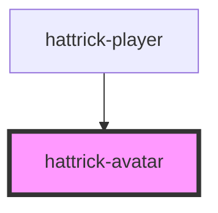

# hattrick-avatar

Displays an avatar from a JSON array of parts.

Example avatar:
```js
const avatarParts = [{
		"url": "backgrounds/bg_blue_int.png",
		"x": 9,
		"y": 10
	}, {
		"url": "//res.hattrick.org/kits/17/167/1664/1663296/body12.png",
		"x": 9,
		"y": 10
	}, {
		"url": "faces/f4h.png",
		"x": 9,
		"y": 10
	}, {
		"url": "eyes/e34c.png",
		"x": 25,
		"y": 16
	}, {
		"url": "mouths/m5c.png",
		"x": 29,
		"y": 66
	}, {
		"url": "noses/n3.png",
		"x": 20,
		"y": 27
	}, {
		"url": "hair/f4h6f.png",
		"x": 9,
		"y": 10
	}
];
```

## Usage

```js
// this will create 7 avatars with various configurations
[
  {}, // default
  { facecard: false },
  { facecard: false, background: false },
  { facecard: false, square: true },
  { facecard: false, square: true, background: false },
  { facecard: false, round: true },
  { facecard: false, round: true, background: false },
].forEach(function (config) {
  const avatar = document.createElement("hattrick-avatar");
  avatar.parts = avatarParts;
  Object.assign(avatar, config);
  avatarHolder.appendChild(avatar);
});
```

Additionally, you can create silhouettes by settings `avatar.parts` to a number. In Hattrick the silhouettes are based on the face type shown as `f1`-`f9` in the faces url. The number represents the number that should be set in `avatar.parts`. E.g. in the example avatar parts above, you would use `avatar.parts = 4`. If neither parts nor a number is provided, a random silhouette will be shown.

## CSS variables

| Variable       | Description       | Default value |
| -------------- | ----------------- | ------------- |
| `--avatar-size` | A decimal value between 0 and 1 allows you to dynamically change the size of the avatar. Technically you could use a value larger than 1, but the avatars doesn't scale well above their original size. | `1` |
| `--avatar-shadow` | Box-shadow around the avatar. Only active when the avatar has a background but no facecard. | `grey 0px 0px 6px` |


<!-- Auto Generated Below -->


## Properties

| Property     | Attribute     | Description                                                                                                                                                                                                                                                               | Type                                | Default          |
| ------------ | ------------- | ------------------------------------------------------------------------------------------------------------------------------------------------------------------------------------------------------------------------------------------------------------------------- | ----------------------------------- | ---------------- |
| `background` | `background`  | Set whether or not the background should be shown.                                                                                                                                                                                                                        | `boolean`                           | `true`           |
| `base`       | `base`        | the base route to the avatars, can be either a relative or absolute url.                                                                                                                                                                                                  | `string`                            | `"/Img/Avatar/"` |
| `composed`   | `composed`    | Set to true if you want all parts to finish loading before showing the avatar. This will make the first paint much slower, but the avatar will never be just partially visible. The time to when the full avatar is printed will not be affected by this setting however. | `boolean`                           | `false`          |
| `facecard`   | `facecard`    | Set whether or not the surrounding card should be shown.                                                                                                                                                                                                                  | `boolean`                           | `true`           |
| `injury`     | `injury`      | Set this to false to remove the bandages on injured and bruised players.                                                                                                                                                                                                  | `boolean`                           | `true`           |
| `kitId`      | `kit-id`      | Allows overriding the default kit by ID.                                                                                                                                                                                                                                  | `number`                            | `0`              |
| `lazy`       | `lazy`        | Set to false to load the avatar directly, as opposed to loading it when it's visible within the viewport.                                                                                                                                                                 | `boolean`                           | `true`           |
| `lazyMargin` | `lazy-margin` | How soon before the avatar comes into view should we start loading it? Accepts CSS-like margin value.                                                                                                                                                                     | `string`                            | ``250px``        |
| `parts`      | `parts`       | An array (or a JSON formatted string) with the parts that builds up the avatar, or a number to display a silhouette.                                                                                                                                                      | `IAvatarPart[] \| number \| string` | `undefined`      |
| `round`      | `round`       | Set to true to generate a circular avatar by cutting off the bottom.                                                                                                                                                                                                      | `boolean`                           | `false`          |
| `square`     | `square`      | Set to true to generate a square avatar by cutting off the bottom.                                                                                                                                                                                                        | `boolean`                           | `false`          |


## Events

| Event  | Description                                                                                                                                                                                                                 | Type               |
| ------ | --------------------------------------------------------------------------------------------------------------------------------------------------------------------------------------------------------------------------- | ------------------ |
| `load` | Let you know when the avatar has finished loading. An array of the images loaded will be provided in the `event.detail`. Real type is `EventEmitter<Array<IAvatarImage>>`, but for TypeScript < 2.7 it needs to be generic. | `CustomEvent<any>` |


## Methods

### `printToCanvas(images?: Array<IAvatarImage>) => Promise<HTMLCanvasElement>`

Prints the images to a canvas. Useful together with `.toDataURL()`.
This may be useful for faster loading at a later time.

#### Parameters

| Name     | Type             | Description                                                                        |
| -------- | ---------------- | ---------------------------------------------------------------------------------- |
| `images` | `IAvatarImage[]` | The avatar parts to print. Defaults to the images already loaded by the component. |

#### Returns

Type: `Promise<HTMLCanvasElement>`


## Dependencies

### Used by

 - [hattrick-player](../player)

### Graph


----------------------------------------------

*Built with [StencilJS](https://stenciljs.com/)*
