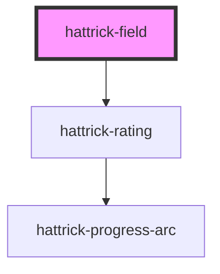

# hattrick-field

<!-- Auto Generated Below -->

## Properties

| Property            | Attribute        | Description | Type                                           | Default     |
| ------------------- | ---------------- | ----------- | ---------------------------------------------- | ----------- |
| `flipped`           | `flipped`        |             | `boolean`                                      | `false`     |
| `ratingNoStar`      | `rating-no-star` |             | `boolean`                                      | `false`     |
| `ratingPositions`   | --               |             | `{ [positionId: number]: IRatingPosition; }`   | `undefined` |
| `size`              | `size`           |             | `number`                                       | `1`         |
| `trainingPositions` | --               |             | `{ [positionId: number]: ITrainingPosition; }` | `undefined` |

## Shadow Parts

| Part              | Description |
| ----------------- | ----------- |
| `"rating"`        |             |
| `"training-slot"` |             |

## Dependencies

### Depends on

- [hattrick-rating](../rating)

### Graph

----------------------------------------------

*Built with [StencilJS](https://stenciljs.com/)*
