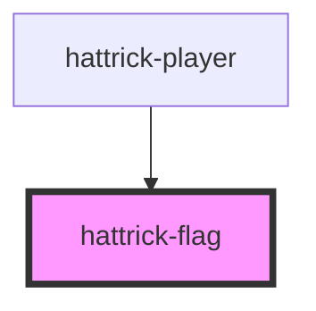

# hattrick-flag

<!-- Auto Generated Below -->

## Properties

| Property   | Attribute   | Description | Type     | Default     |
| ---------- | ----------- | ----------- | -------- | ----------- |
| `leagueId` | `league-id` |             | `number` | `undefined` |

## Shadow Parts

| Part      | Description |
| --------- | ----------- |
| `"image"` |             |

## Dependencies

### Used by

 - [hattrick-player](../player)

### Graph

----------------------------------------------

*Built with [StencilJS](https://stenciljs.com/)*
