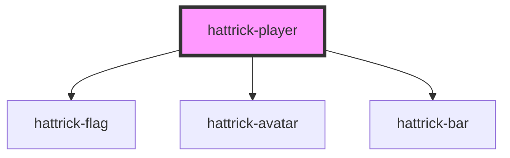

# hattrick-player

<!-- Auto Generated Below -->

## Properties

| Property                        | Attribute                          | Description | Type      | Default     |
| ------------------------------- | ---------------------------------- | ----------- | --------- | ----------- |
| `avatarSet`                     | `avatar-set`                       |             | `string`  | `"Avatar"`  |
| `countryId`                     | `country-id`                       |             | `number`  | `undefined` |
| `debounce`                      | `debounce`                         |             | `number`  | `300`       |
| `hideNumbersAfterDenominations` | `hide-numbers-after-denominations` |             | `boolean` | `false`     |
| `languageId`                    | `language-id`                      |             | `number`  | `2`         |
| `playerId`                      | `player-id`                        |             | `number`  | `undefined` |
| `skillPresentation`             | `skill-presentation`               |             | `number`  | `2`         |
| `token`                         | `token`                            |             | `string`  | `undefined` |

## Methods

### `hide() => Promise<void>`

#### Returns

Type: `Promise<void>`

### `show() => Promise<void>`

#### Returns

Type: `Promise<void>`

## Dependencies

### Depends on

- [hattrick-flag](../flag)
- [hattrick-avatar](../avatar)
- [hattrick-bar](../bar)

### Graph

----------------------------------------------

*Built with [StencilJS](https://stenciljs.com/)*
