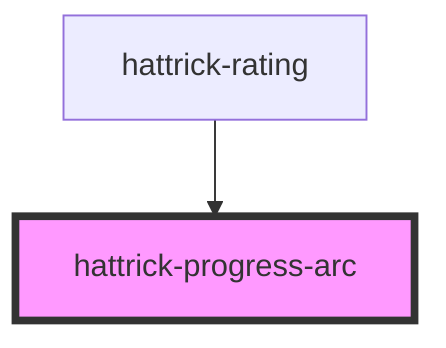

# hattrick-progress-arc

This is a Stencil fork of [angular-progress-arc](https://github.com/jesujcastillom/angular-progress-arc) (thanks to [jesujcastillom](https://github.com/jesujcastillom)), used to display circular progress meters, or in Hattrick used to display stamina.

## CSS variables

| Variable       | Description       | Default value |
| -------------- | ----------------- | ------------- |
| `--progress-arc-stroke-width`  | Thickness of the circle. | `8px` |
| `--progress-arc-color`  | Color of the arc. | `#00aa00` |
| `--progress-arc-rest-color`  | Color of the remaining part to complete the circle. | `transparent` |

<!-- Auto Generated Below -->

## Properties

| Property           | Attribute           | Description                                                    | Type      | Default     |
| ------------------ | ------------------- | -------------------------------------------------------------- | --------- | ----------- |
| `angle`            | `angle`             |                                                                | `number`  | `0`         |
| `circumference`    | `circumference`     |                                                                | `number`  | `360`       |
| `complete`         | `complete`          | Expression evaluating to float [0.0, 1.0]                      | `number`  | `undefined` |
| `counterClockwise` | `counter-clockwise` | Indicating if the progress should instead be counter clockwise | `boolean` | `false`     |
| `size`             | `size`              | Size of element in pixels.                                     | `number`  | `undefined` |

## Dependencies

### Used by

 - [hattrick-rating](../rating)

### Graph

----------------------------------------------

*Built with [StencilJS](https://stenciljs.com/)*
