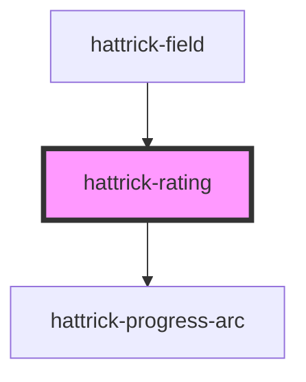

# hattrick-rating

Used to display a Hattrick rating. Uses [progress-arc](../progress-arc/) to display stamina.


## Usage
```html
<hattrick-rating size="large" rating="14.5" stamina="0.8"></hattrick-rating>
<hattrick-rating size="small" rating="14.5" stamina="0.6"></hattrick-rating>

<hattrick-rating size="44" rating="14.5" stamina="0.4"></hattrick-rating>
<hattrick-rating size="29" rating="14.5" stamina="0.2"></hattrick-rating>
```

## CSS Variables

| Variable       | Description       | Default value |
| -------------- | ----------------- | ------------- |
| `--rating-background`  | The background color. | `#FFFFFF` |
| `--rating-color`  | The text color. | `#666666` |
| `--rating-font-weight`  | The font-weight. | `bold` |
| `--rating-stamina-arc-very-low`  | Color of the stamina bar when below 25%. | `#DD4140` |
| `--rating-stamina-arc-low`  | Color of the stamina bar when between 25% and 49%. | `#F5A104` |
| `--rating-stamina-arc-high`  | Color of the stamina bar when below 50% and 74%. | `#F1C40A` |
| `--rating-stamina-arc-very-high`  | Color of the stamina bar when above 75%. | `#31A94B` |
| `--rating-stamina-arc-rest`  | The color of the remaining part to complete the circle. | `#CCCCCC` |

<!-- Auto Generated Below -->


## Properties

| Property       | Attribute       | Description                                                        | Type                                       | Default     |
| -------------- | --------------- | ------------------------------------------------------------------ | ------------------------------------------ | ----------- |
| `noStar`       | `no-star`       |                                                                    | `boolean`                                  | `false`     |
| `rating`       | `rating`        | The rating to show inside the stamina.                             | `number`                                   | `undefined` |
| `size`         | `size`          | Size of element in pixels.                                         | `"large" \| "medium" \| "small" \| number` | `"small"`   |
| `stamina`      | `stamina`       | Stamina in percentage between 0 and 1.                             | `number`                                   | `undefined` |
| `staminaLabel` | `stamina-label` | Label for the mouseover, formatted as `{staminaLabel}: {stamina}%` | `string`                                   | `""`        |


## Shadow Parts

| Part             | Description |
| ---------------- | ----------- |
| `"progress-arc"` |             |
| `"rating"`       |             |
| `"rating-full"`  |             |
| `"rating-half"`  |             |


## Dependencies

### Used by

 - [hattrick-field](../field)

### Depends on

- [hattrick-progress-arc](../progress-arc)

### Graph


----------------------------------------------

*Built with [StencilJS](https://stenciljs.com/)*
