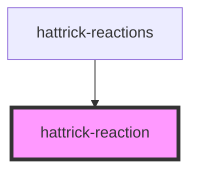

# hattrick-reaction

<!-- Auto Generated Below -->

## Properties

| Property         | Attribute          | Description | Type      | Default                                     |
| ---------------- | ------------------ | ----------- | --------- | ------------------------------------------- |
| `amount`         | `amount`           |             | `number`  | `undefined`                                 |
| `ariaLabel`      | `aria-label`       |             | `string`  | `undefined`                                 |
| `disabled`       | `disabled`         |             | `boolean` | `false`                                     |
| `reaction`       | `reaction`         |             | `string`  | `undefined`                                 |
| `reactionTypeId` | `reaction-type-id` |             | `number`  | `undefined`                                 |
| `selected`       | `selected`         |             | `boolean` | `false`                                     |
| `sourceId`       | `source-id`        |             | `number`  | `undefined`                                 |
| `sourceTypeId`   | `source-type-id`   |             | `number`  | `undefined`                                 |
| `token`          | `token`            |             | `string`  | `(window as any).HT?.ngHattrick?.userToken` |

## Events

| Event      | Description | Type                         |
| ---------- | ----------- | ---------------------------- |
| `reaction` |             | `CustomEvent<ReactionEvent>` |

## Shadow Parts

| Part         | Description |
| ------------ | ----------- |
| `"amount"`   |             |
| `"checkbox"` |             |
| `"label"`    |             |
| `"reaction"` |             |

## Dependencies

### Used by

 - [hattrick-reactions](../reactions)

### Graph

----------------------------------------------

*Built with [StencilJS](https://stenciljs.com/)*
