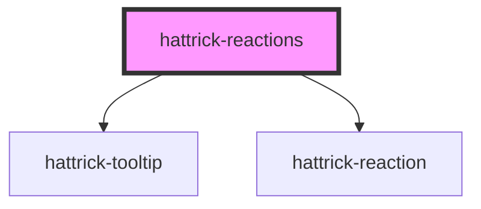

# hattrick-reactions

<!-- Auto Generated Below -->

## Properties

| Property       | Attribute        | Description | Type                                                                                                                                                                 | Default                                     |
| -------------- | ---------------- | ----------- | -------------------------------------------------------------------------------------------------------------------------------------------------------------------- | ------------------------------------------- |
| `disabled`     | `disabled`       |             | `boolean`                                                                                                                                                            | `false`                                     |
| `placement`    | `placement`      |             | `"bottom" \| "bottom-end" \| "bottom-start" \| "left" \| "left-end" \| "left-start" \| "right" \| "right-end" \| "right-start" \| "top" \| "top-end" \| "top-start"` | `"bottom-start"`                            |
| `reactions`    | --               |             | `IReaction[]`                                                                                                                                                        | `[]`                                        |
| `sourceId`     | `source-id`      |             | `number`                                                                                                                                                             | `undefined`                                 |
| `sourceTypeId` | `source-type-id` |             | `number`                                                                                                                                                             | `undefined`                                 |
| `texts`        | --               |             | `IReactionTexts`                                                                                                                                                     | `undefined`                                 |
| `token`        | `token`          |             | `string`                                                                                                                                                             | `(window as any).HT?.ngHattrick?.userToken` |

## Shadow Parts

| Part                | Description |
| ------------------- | ----------- |
| `"add-button"`      |             |
| `"dropdown"`        |             |
| `"dropdown-button"` |             |

## Dependencies

### Depends on

- [hattrick-tooltip](../tooltip)
- [hattrick-reaction](../reaction)

### Graph

----------------------------------------------

*Built with [StencilJS](https://stenciljs.com/)*
