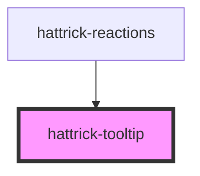

# hattrick-tooltip

With a design inspired by [ngx-charts tooltips](https://github.com/swimlane/ngx-charts) this provides a relatively customizable tooltip for custom mouseover titles that also supports HTML.

## Usage

```html
<hattrick-tooltip position="right" arrow="middle" content="Here's pure text tooltip">
  Mouseover me for a tooltip!
</hattrick-tooltip>

<hattrick-tooltip position="right" arrow="middle">
  <any slot="content">
    <b>Use</b>
    `slot="content"`
    <i>for</i>
    <u>HTML</u>
  </any>
  
</hattrick-tooltip>
```

## CSS variables

| Variable       | Description       | Default value |
| -------------- | ----------------- | ------------- |
| `--tooltip-background`  | Background of the tooltip. | `rgba(0, 0, 0, .75)` |
| `--tooltip-color`  | Text color in the tooltip. | `white` |
| `--tooltip-font-size`  | Font size in the tooltip. | `12px` |
| `--tooltip-border`  | Set a border on the tooltip, e.g. `--tooltip-border: 1px solid #767676;`. | `0` |
| `--tooltip-padding`  | Padding in the tooltip. | `5px 10px` |
| `--tooltip-box-shadow`  | Set a box-shadow on the tooltip, e.g. `4px 4px 2px -3px #767676`. | `none` |
| `--tooltip-max-width`  | Maximum width before wrapping. | `400px` |
| `--tooltip-arrow-size`  | The size of the arrow. | `7px` |
| `--tooltip-border-radius`  | Border radius of the tooltip. | `3px` |
| `--tooltip-pointer-events`  | If you want to be able to select text in the tooltip, you can change the pointer-events which is disabled by default by setting for example: `--tooltip-pointer-events: auto;`. | `none` |
| `--tooltip-delay`  | If you want a short delay before the tooltip shows up, e.g. `--tooltip-delay: 300ms;`.. | `0s` |

<!-- Auto Generated Below -->


## Properties

| Property     | Attribute     | Description                                                                                                                                                                                                               | Type                                                | Default     |
| ------------ | ------------- | ------------------------------------------------------------------------------------------------------------------------------------------------------------------------------------------------------------------------- | --------------------------------------------------- | ----------- |
| `alwaysShow` | `always-show` |                                                                                                                                                                                                                           | `boolean`                                           | `false`     |
| `arrow`      | `arrow`       | The position of the arrow. Will be ignored if `position` is not set. `start` will put the arrow to the left or top. `middle` will put the arrow to the middle or center. `end` will put the arrow to the right or bottom. | `"end" \| "middle" \| "none" \| "start"`            | `"none"`    |
| `content`    | `content`     | The content of the title. Can also be set with `slot="content"` to enable HTML in the tooltip.                                                                                                                            | `string`                                            | `""`        |
| `dir`        | `dir`         |                                                                                                                                                                                                                           | `string`                                            | `undefined` |
| `disabled`   | `disabled`    |                                                                                                                                                                                                                           | `boolean`                                           | `false`     |
| `position`   | `position`    | Which side of the element the tooltip should be shown. `cursor` will put it approximately below the cursor. Using `cursor` will also disable animations.                                                                  | `"bottom" \| "cursor" \| "end" \| "start" \| "top"` | `"cursor"`  |


## Methods

### `close() => Promise<void>`


#### Returns

Type: `Promise<void>`


### `open(ev?: MouseEvent) => Promise<void>`


#### Parameters

| Name | Type         | Description |
| ---- | ------------ | ----------- |
| `ev` | `MouseEvent` |             |

#### Returns

Type: `Promise<void>`


## Dependencies

### Used by

 - [hattrick-reactions](../reactions)

### Graph


----------------------------------------------

*Built with [StencilJS](https://stenciljs.com/)*
